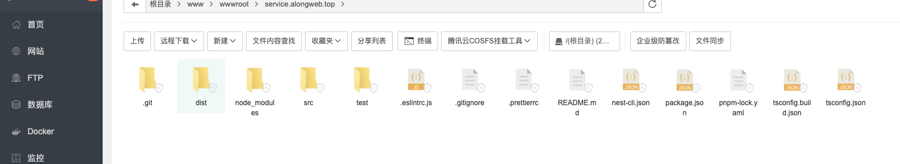
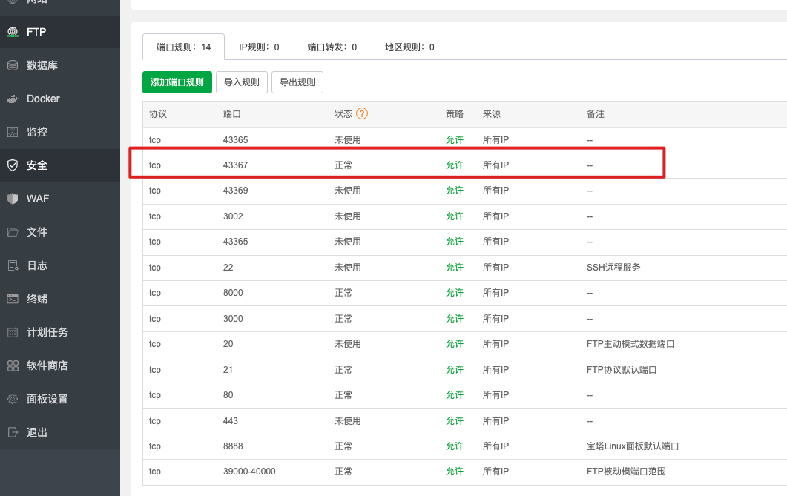
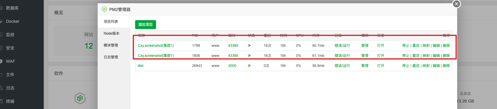
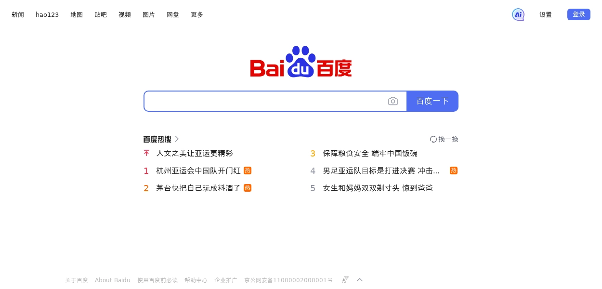

# cxy-screenshot

一个 demo，提供一个截图服务，基于 puppeteer 生成屏幕快照

## 安装

```bash
pnpm i
```

## 本地运行

```bash
pnpm dev
```

## 打包

```bash
pnpm build
```

## 服务器运行 dist/

```bash
# development
pm2 start ecosystem.config.js --env dev

#test
pm2 start ecosystem.config.js --env test

#uat
pm2 start ecosystem.config.js --env uat

#production
pm2 start ecosystem.config.js --env prod
```

## pm2 配置

```js
module.exports = {
  apps: [
    {
      name: 'Cxy.screenshot', //项目名称
      script: './main.js', //入口文件
      watch: true,
      instances: 2, //分配到4个cpu上 取决于cpu数量 可设置max,所有cpu
      exec_mode: 'cluster', //个实例之间进行负载平衡
      max_memory_restart: '30720M', //堆内存30G自动重启，不会中断服务，已测试
      env: {
        //dev环境
        PORT: 43365,
        NODE_ENV: 'dev',
      },
      env_test: {
        //测试环境
        PORT: 43365,
        NODE_ENV: 'test',
      },
      env_uat: {
        //uat环境
        PORT: 43369,
        NODE_ENV: 'uat',
      },
      env_prod: {
        //生产环境
        PORT: 43367,
        NODE_ENV: 'prod',
      },
    },
  ],
};
```

## 浏览器线程池

```js
export class creatBrowser {
  constructor() {
    const WSE_LIST = []; //存储browserWSEndpoint列表
    let browserWSEndpoint = null; //浏览器对象
    (async () => {
      for (let i = 0; i < globalService.MAX_WSE; i++) {
        const browser = await puppeteer.launch({
          headless: true,
          args: [
            '--disable-gpu',
            '--disable-dev-shm-usage',
            '--disable-setuid-sandbox',
            '--no-first-run',
            '--no-sandbox',
            '--no-zygote',
            '--single-process',
          ],
        });
        browserWSEndpoint = await browser.wsEndpoint();
        WSE_LIST[i] = browserWSEndpoint;
      }
      globalService.WSE_LIST = WSE_LIST;
      console.log('创建浏览器成功:' + WSE_LIST);
      console.log('端口号:' + globalService.ENV);
    })();
  }
}
```

## 部署

`linux服务器`,新建网站域名，文件上传域名目录下，宝塔面板如下。



安装依赖

```bash
pnpm i
```

打包

```bash
pnpm build
```

运行

```bash
cs dist
pm2 start ecosystem.config.js --env prod
```

字体下载

```bash
sudo yum install wqy-microhei-fonts.noarch -y
```

浏览器下载

```bash
wget https://dl.google.com/linux/direct/google-chrome-stable_current_amd64.deb
```

端口放行



pm2 进程查看



## 接口参数

`url`

```bash
POST http://service.alongweb.top:43367/screenshot
```

`params`

| **key**  | **类型** | **默认值** | **说明**                                 |
| -------- | -------- | ---------- | ---------------------------------------- |
| fullPage | boolean  | true       | 是否滚动截屏                             |
| width    | number   | -          | 自定义截屏宽度, 默认不设置               |
| height   | number   | -          | 自定义截屏高度 ,默认不设置               |
| -        | -        | -          | 可自定义其他参数,会拼接在打开页面 url 上 |

`body`

| **key**   | **类型** | **默认值** | **说明**                         |
| --------- | -------- | ---------- | -------------------------------- |
| url       | string   | ''         | 打开页面 url,必传                |
| className | string   | -          | 等待元素加载完成，开始截屏，可传 |

## 案例

### 测试一

```js
axios.post('http://service.alongweb.top:43367/screenshot',
  data: {
    url: 'http://www.alongweb.top'
  }
)
```

浏览器查看


### 测试二

```js
axios.post('http://service.alongweb.top:43367/screenshot',
  data: {
    url: 'http://www.baidu.com'
  }
)
```

浏览器查看


